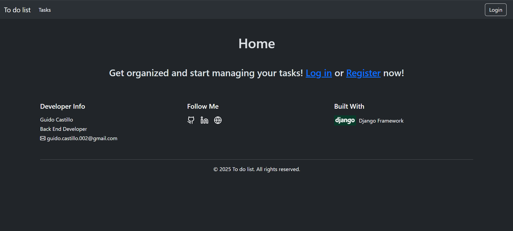
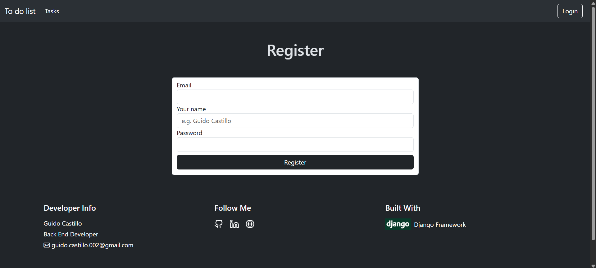
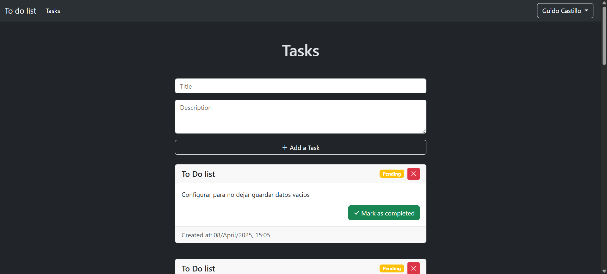

# To Do List 📝

Aplicación web para gestionar tus tareas de manera eficiente creada con Django.

## 🖼️ Capturas

## 📋 Características

- Registro de usuario
- Agregar, ver y eliminar tareas propias por cada usuario
- Base de datos guardada en la nube
- Interfaz sencilla y fácil de utilizar

## 🚀 Uso

La aplicación está online, puedes probarla en:
https://todolist-h3yb.onrender.com/

## 🛠️ Tecnologías Utilizadas

- Python
- Django framework
- Supabase API para gestión de base de datos
- Bootstrap para el diseño
- Render para desplegar la app